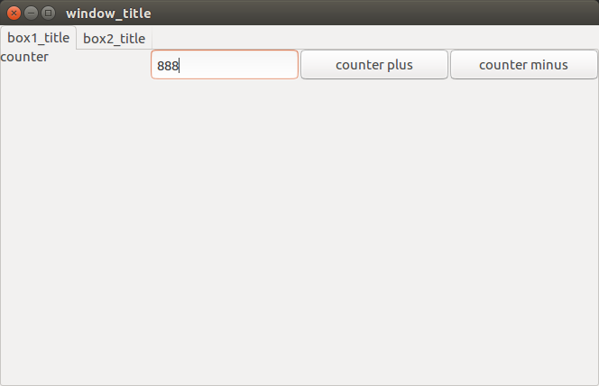

# layerui
a mvc ui base on go andlabs ui

#Installation
go get github.com/jmesyan/layerui

#Documentation
the ui is based on andlabs ui,you can easy use the ui by layerui,I have write a demo in the uidemo.
you can test the demo by  cd in yourpath/github.com/jmesyan/layerui/uidemo and then run the command `go test`

how to use andlabs ui,see here(https://github.com/andlabs/ui)

how to use layerui,base on the uidemo,I will give a brief description

In the directory named "view",you can organize your ui,just like this:
```
func hbox1()*layerui.LayContainer{
	box:=new(layerui.LayContainer)
	box.LcType=layerui.LcBox
	box.Stretchy=false
	box.Box=ui.NewHorizontalBox()
	box.AddWidget("label",layerui.LayWidget{ui.NewLabel("counter"),true})
	box.AddWidget("counter",layerui.LayWidget{ui.NewEntry(),true})
	box.AddWidget("counter_plus",layerui.LayWidget{ui.NewButton("counter plus"),true})
	box.AddWidget("counter_minus",layerui.LayWidget{ui.NewButton("counter minus"),true})
	box.Compose()
	return box
}
```

In the directory named "model",you can set model value,just like this:
```
func GetDefaultCount()string{
	return "888"
}
```

In the directory named "control",you can get the model value and control ui,just like this:

```
func tab1Ctr(tab1 *layerui.LayContainer){
	box1:=tab1.Widget("box1").(*layerui.LayContainer)
	hbox:=box1.Widget("hbox").(*layerui.LayContainer)
	//init the counter
	counter:=hbox.Widget("counter").(*ui.Entry)
	counter.SetReadOnly(true)
	//get the model value
	count:=model.GetDefaultCount()
	counter.SetText(count)
	//button control
	buttonPlus:=hbox.Widget("counter_plus").(*ui.Button)
	buttonPlus.OnClicked(func(b *ui.Button){
		textNum,_:=strconv.Atoi(counter.Text())
		num:=textNum+1
		counter.SetText(strconv.Itoa(num))
	})

	buttonMinus:=hbox.Widget("counter_minus").(*ui.Button)
	buttonMinus.OnClicked(func(b *ui.Button){
		textNum,_:=strconv.Atoi(counter.Text())
		num:=textNum-1
		counter.SetText(strconv.Itoa(num))
	})

}
```
the finally effect like this:

**I think layerui can makes you more simple create a ui and control ui,enjoy it,welcome join me to improve the layerui!**


